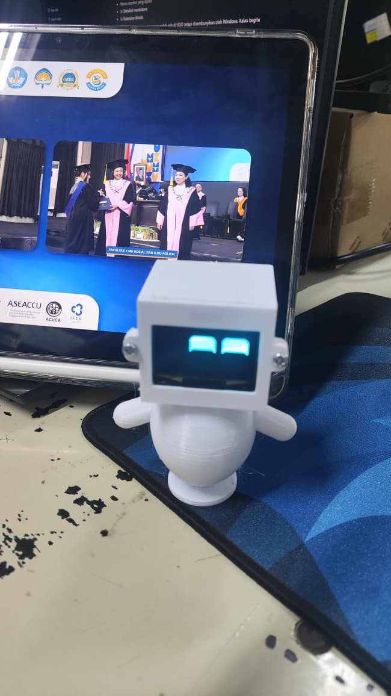

# 🤖 EVA - Expressive Desktop Robot

A tiny desktop robot powered by ESP32-C3, MPU6050, and OLED display that can express emotions through animated eyes.

<p align="center">
  
</p>

---

## 🎯 About EVA

EVA is the official mascot of the Robotics Community at Universitas Atma Jaya Yogyakarta (UAJY).

This little robot was created as a graduation gift for our fellow robotics members who are moving on to the next chapter of their lives.

While EVA may only have a small OLED screen and a few electronic components, it carries something much larger: the spirit of curiosity, creativity, teamwork, and friendship that defines our community.

Through its animated expressions and playful reactions, EVA symbolizes the journey we shared together—from our first lines of code, failed prototypes, and competition preparations, to the successful projects and memories that shaped us as engineers.

As our graduates step into the professional world, we hope EVA remains a small companion and a reminder that they will always be part of the Robotics UAJY family.

**Once a roboticist, always a roboticist. 🤖❤️**

---

## 🖨️ 3D Model & CAD Files

The complete EVA design is available through Autodesk Fusion 360.

### Accessing the Project

1. Create or sign in to your Autodesk account.
2. Install Autodesk Fusion 360.
3. Contact @diordty in Instagram for request access to the EVA project workspace.
4. Once access is granted, the project will appear inside your Fusion Team Hub.

Project Structure:

```text
EVA
├── BODY
├── head_outer
├── head_inner
├── esp32 c3 supermini
├── MPU6050 v2
├── Display_OLED_SSD1306_1.3inch
├── baterai
├── cargador USB tipo C Ultra mini
└── ...
```

### Included Files

- Complete robot body assembly
- Printable STL-ready parts
- Electronics component models
- Parametric Fusion 360 source files
- Version history for future improvements

### Contribution & Modifications

Community members are welcome to contribute improvements and new ideas for EVA.

To request edit access to the Fusion project, please contact the project maintainer. Access permissions are managed individually to ensure the integrity and continuity of the official EVA design.

This allows future generations of Robotics UAJY members to continue developing EVA while preserving previous versions of the project.

> EVA is intended to be a long-term community mascot project that can evolve across generations of Robotics UAJY members.

````
---

## ✨ Features

- 👀 Smooth animated eyes using FluxGarage RoboEyes
- 😴 Idle behavior with blinking and happy expressions
- 📳 Shake detection using MPU6050
- 😵 Dizzy reaction when shaken
- 😠 Angry expression
- 😑 Flat-eye expression
- 😢 Sad expression
- 🔋 Battery powered using LiPo battery
- ⚡ Portable and standalone operation

---

## 🎭 Emotion Flow

The robot reacts to physical interaction through a simple emotional state machine.

```text
          ┌────────────┐
          │    Idle    │
          │ 😊 😄 😉    │
          └─────┬──────┘
                │
                │ Shake detected
                ▼
          ┌────────────┐
          │  Flicker   │
          │ ⚡⚡⚡⚡⚡    │
          └─────┬──────┘
                │
                ▼
          ┌────────────┐
          │   Dizzy    │
          │ 😵😵😵      │
          └─────┬──────┘
                │
                ▼
          ┌────────────┐
          │   Angry    │
          │ 😠😠😠      │
          └─────┬──────┘
                │
                ▼
          ┌────────────┐
          │ Flat Eyes  │
          │  -    -    │
          └─────┬──────┘
                │
                ▼
          ┌────────────┐
          │    Sad     │
          │ 😢😢😢      │
          └─────┬──────┘
                │
                ▼
          ┌────────────┐
          │    Idle    │
          └────────────┘
````

---

## 🛠 Hardware

| Component           | Description              |
| ------------------- | ------------------------ |
| ESP32-C3 Super Mini | Main Controller          |
| MPU6050             | Motion & Shake Detection |
| OLED SH1106 128x64  | Face Display             |
| LiPo Battery 3.7V   | Power Source             |
| TP4056              | Battery Charging Module  |
| Slide Switch        | Power Control            |
| 3D Printed Body     | Robot Enclosure          |

---

## 🔌 Wiring

<p align="center">
  
</p>

### OLED

| OLED | ESP32-C3 |
| ---- | -------- |
| VCC  | 3V3      |
| GND  | GND      |
| SDA  | GPIO8    |
| SCL  | GPIO9    |

### MPU6050

| MPU6050 | ESP32-C3 |
| ------- | -------- |
| VCC     | 3V3      |
| GND     | GND      |
| SDA     | GPIO8    |
| SCL     | GPIO9    |

### Power

```text
LiPo Battery
      │
      ▼
   TP4056
      │
      ▼
 Power Switch
      │
      ▼
 ESP32-C3 5V
```

---

## 📚 Libraries

- FluxGarage RoboEyes
- Adafruit GFX
- Adafruit SH110X
- Adafruit MPU6050
- Adafruit Unified Sensor

---
